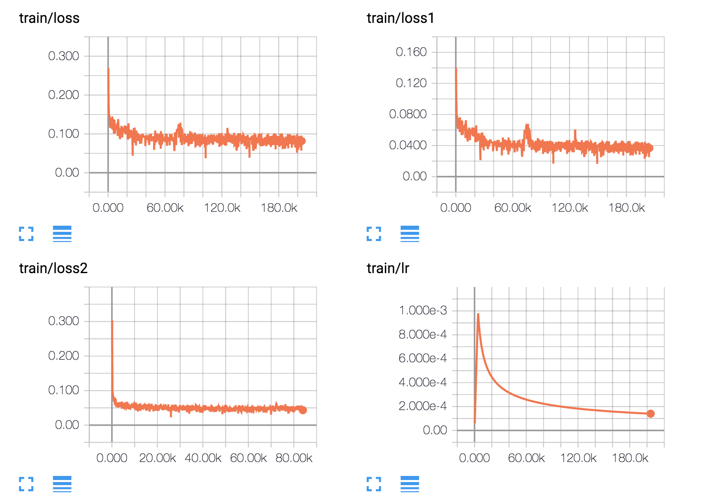
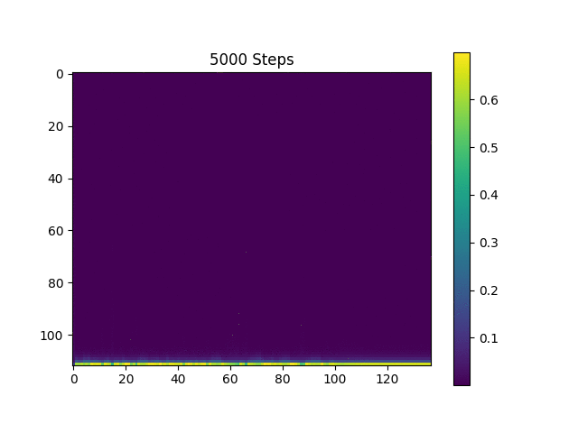

# A (Heavily Documented) TensorFlow Implementation of Tacotron: A Fully End-to-End Text-To-Speech Synthesis Model

## Requirements

  * NumPy >= 1.11.1
  * TensorFlow >= 1.3
  * librosa
  * tqdm
  * matplotlib
  * scipy

## Data

We train the model on three different speech datasets.
  1. [LJ Speech Dataset](https://keithito.com/LJ-Speech-Dataset/)
  2. [Nick Offerman's Audiobooks](https://www.audible.com.au/search?searchNarrator=Nick+Offerman)
  3. [The World English Bible](https://www.kaggle.com/bryanpark/the-world-english-bible-speech-dataset)

LJ Speech Dataset is recently widely used as a benchmark dataset in the TTS task because it is publicly available. It has 24 hours of reasonable quality samples.
Nick's audiobooks are additionally used to see if the model can learn even with less data, variable speech samples. They are 18 hours long.
[The World English Bible](https://en.wikipedia.org/wiki/World_English_Bible) is a public domain update of the American Standard Version of 1901 into modern English. Its original audios are freely available [here](http://www.audiotreasure.com/webindex.htm). Kyubyong split each chapter by verse manually and aligned the segmented audio clips to the text. They are 72 hours in total. You can download them at [Kaggle Datasets](https://www.kaggle.com/bryanpark/the-world-english-bible-speech-dataset).

## Training
  * STEP 0. Download [LJ Speech Dataset](https://keithito.com/LJ-Speech-Dataset/) or prepare your own data.
  * STEP 1. Adjust hyper parameters in `hyperparams.py`. (If you want to do preprocessing, set `prepro` True`.
  * STEP 2. Run `python train.py`. (If you set `prepro` True, run `python prepro.py` first)
  * STEP 3. Run `python eval.py` regularly during training.

## Sample Synthesis

We generate speech samples based on [Harvard Sentences](http://www.cs.columbia.edu/~hgs/audio/harvard.html) as the original paper does. It is already included in the repo.

  * Run `python synthesize.py` and check the files in `samples`.

## Training Curve

## Attention Plot

## Generated Samples

  * [LJ at 200k steps](https://soundcloud.com/kyubyong-park/sets/tacotron_lj_200k)
  * [Nick at 215k steps](https://soundcloud.com/kyubyong-park/sets/tacotron_nick_215k)
  * [WEB at 183k steps](https://soundcloud.com/kyubyong-park/sets/tacotron_web_183k)

## Pretrained Files
  * Keep in mind 200k steps may not be enough for the best performance.
  * [LJ 200k](https://www.dropbox.com/s/8kxa3xh2vfna3s9/LJ_logdir.zip?dl=0)
  * [WEB 200k](https://www.dropbox.com/s/g7m6xhd350ozkz7/WEB_logdir.zip?dl=0)
  
## Notes

  * It's important to monitor the attention plots during training.  If the attention plots look good (alignment looks linear), and then they look bad (the plots will look similar to what they looked like in the begining of training), then training has gone awry and most likely will need to be restarted from a checkpoint where the attention looked good, because we've learned that it's unlikely that the loss will ever recover.  This deterioration of attention will correspond with a spike in the loss.

  * In the original paper, the authors said, "An important trick we discovered was predicting multiple, non-overlapping output frames at each decoder step" where the number of of multiple frame is the reduction factor, `r`.  We originally interpretted this as predicting non-sequential frames during each decoding step `t`.  Thus were using the following scheme (with `r=5`) during decoding.
        
        
        t    frame numbers
        -----------------------
        0    [ 0  1  2  3  4]
        1    [ 5  6  7  8  9]
        2    [10 11 12 13 14]
        ...
        
      After much experimentation, we were unable to have our model learning anything useful.  We then switched to predicting `r` sequential frames during each decoding step.
          
        
        t    frame numbers
        -----------------------
        0    [ 0  1  2  3  4]
        1    [ 5  6  7  8  9]
        2    [10 11 12 13 14]
        ...
        
      With this setup we noticed improvements in the attention and have since kept it.

  * **Perhaps the most important hyperparemeter is the learning rate.**  With  an intitial learning rate of 0.002 we were never able to learn a clean attention, the loss would frequently explode.  With an initial learning rate of 0.001 we were able to learn a clean attention and train for much longer get decernable words during synthesis.
  * Check other TTS models such as [DCTTS](https://github.com/kyubyong/dc_tts) or [deep voice 3](https://github.com/kyubyong/deepvoice3).

### Differences from the original paper

  * We use Noam style warmup and decay.
  * We implement gradient clipping.
  * Our training batches are bucketed.
  * After the last convolutional layer of the post-processing net, we apply an affine transformation to bring the dimensionality up to 128 from 80, because the required dimensionality of highway net is 128.  In the original highway networks paper, the authors mention that the dimensionality of the input can also be increased with zero-padding, but they used the affine transformation in all their experiments.  We do not know what the Tacotron authors chose.

## Papers that referenced this repo

  * [Efficiently Trainable Text-to-Speech System Based on Deep Convolutional Networks with Guided Attention](https://arxiv.org/abs/1710.08969)
  * [Storytime - End to end neural networks for audiobooks](http://web.stanford.edu/class/cs224s/reports/Pierce_Freeman.pdf)
  
  Jan. 2018,
  Kyubyong Park & [Tommy Mulc](tmulc18@gmail.com)
